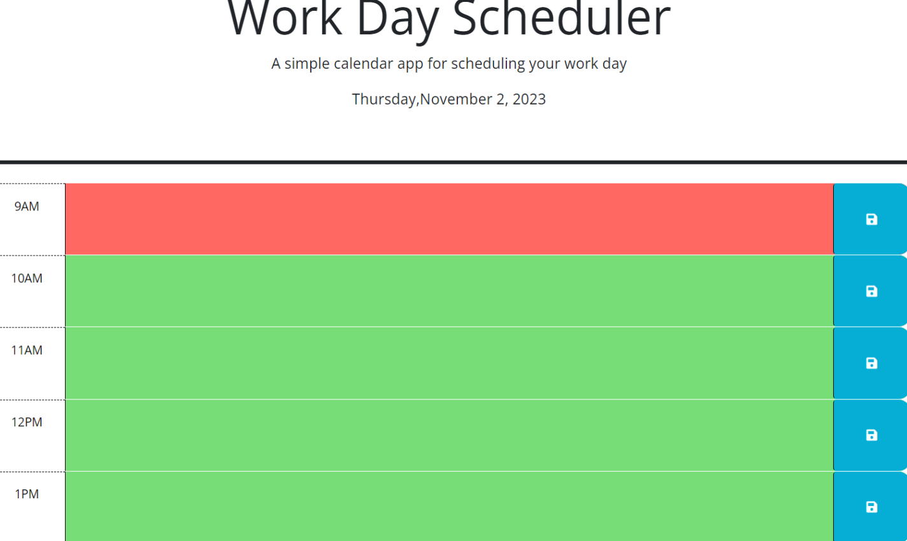

##  Description
Created a schedule for workday hous between 9am to 5pm that allows user to input their daily task in time slot.
This time slot past hors listed in the grey color, present hour in red color and future hours shows in the green color.
This makes user to know that what times they are available.
User can visulize that which task deadline is approaching and prioritize task. 
Refresh the color code every hour.

This work schedule built with 
HTML
CSS
JAVASCRIPT
JQUERY
DAY.JS 
BOOTSTRAP

## Website
https://lalitakapadia.github.io/workday-scheduler/

